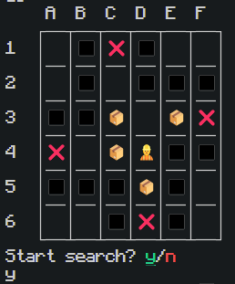
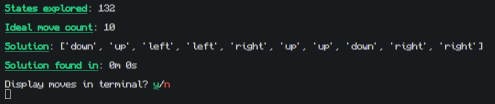
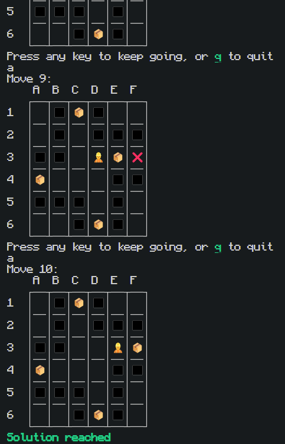

<a name="top"></a>


# Sokoban-AI
AI solution search algorithm for Sokoban

## 🗂️ Table of Contents
- [About](#-about)
- [Demo](#-demo)
- [Tips](#%EF%B8%8F-tips)

## 📦 About

This program utilizes Artificial Intelligence to find the solution with the least amount of moves for the logical puzzle video game [Sokoban](https://en.wikipedia.org/wiki/Sokoban). Using Breadth-First Search or optionally Depth-First Search, this program goes through possible states until a valid one is found, then walks the user through the steps in the terminal, as shown in [Demo](#-demo). This program was built onto [source code](https://cs50.harvard.edu/ai/2024/weeks/0/) provided by Harvard's CS50 course. Licensing information can be found [here](https://cs50.harvard.edu/x/2024/license/)).

"Sokoban (倉庫番, Sōko-ban, lit. 'warehouse keeper') is a puzzle video game in which the player pushes boxes around in a warehouse, trying to get them to storage locations. The game was designed in 1981 by Hiroyuki Imabayashi, and first released in December 1982 for the PC-80, PC-88, and FM-7 computers."

## 👷 Demo
<div align="center">
  
  
  
</div>

## 🖌️ Tips
- If you wish to try out DFS instead of BFS, you can switch out the class names in `solve()`.
```python
class SokobanAI:
  def solve(self):
    """Finds a solution to puzzle, if one exists."""
    
    # Keep track of number of states explored
    self.num_explored = 0
    
    # Initialize frontier to just the starting position
    start = Node(state=self.start, parent=None, action=None)
    frontier = QueueFrontier()
    #          ^^^^^^^^^^^^^^^ Switch this out with StackFrontier()
```
- You can use the provided [lookup chart](./lookupchart.txt) to find what different emojis represent.
- Feel free to switch out the display method in `printGrid()` to fit your terminal. Some emojis and spaces might appear out of place for you, as this was fitted to work with the VS Code terminal.

[Back to top](#top)
